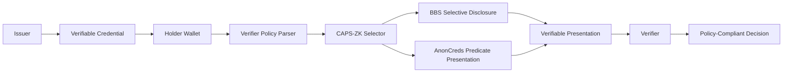
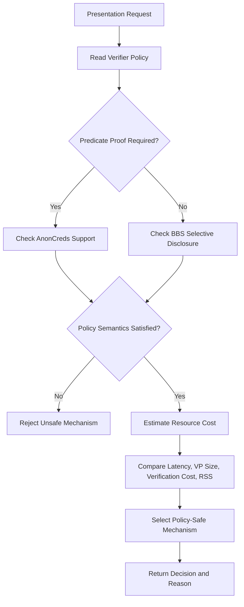

# LightDID-ZKP

LightDID-ZKP is a policy- and resource-aware research prototype for selecting between BBS selective-disclosure presentations and AnonCreds predicate presentations in privacy-preserving decentralized identity systems.

Full form: Lightweight Decentralized Identity Zero-Knowledge Presentation Selector
Tagline: A policy-aware and resource-aware selector for privacy-preserving verifiable presentations.

---

## Project Summary

LightDID-ZKP addresses a practical problem in decentralized identity systems: a holder wallet may support more than one privacy-preserving presentation mechanism, but the best choice depends on verifier policy, attribute disclosure requirements, predicate proof needs, proof size, latency, verification cost, and available device resources.

The project introduces **CAPS-ZK**, a lightweight selection layer that chooses between:

* **BBS selective disclosure**, when the verifier requires selected credential attributes to be revealed.
* **AnonCreds predicate presentation**, when the verifier requires credential-backed predicate proofs.
* **Policy-safe fallback**, when one mechanism is cheaper but does not satisfy verifier semantics.

The repository contains source code, policy configurations, benchmark summaries, experiment scripts, result tables, diagrams, tests, and GitHub Wiki documentation.

---

## Key Features

* Policy-aware selection between BBS and AnonCreds presentations.
* Resource-aware decision logic using latency, proof size, verification cost, and memory indicators.
* CAPS-ZK selector for wallet-side presentation orchestration.
* Verifier-policy guard to prevent unsafe cost-only decisions.
* BBS selective-disclosure profile for attribute-level reveal scenarios.
* AnonCreds predicate profile for credential-backed predicate scenarios.
* Synthetic experiment driver for reproducibility and plotting.
* Benchmark summary CSV files aligned with the manuscript experiment setup.
* Ablation study showing why cost-first fallback is unsafe.
* Resource-sensitivity analysis across different holder profiles.
* Architecture diagrams and result figures for GitHub and manuscript explanation.
* GitHub Wiki with separate pages for architecture, policy model, experiments, results, and developer notes.

---

## System Architecture



The architecture separates credential issuance, wallet-side presentation selection, cryptographic presentation generation, and verifier-side policy checking. CAPS-ZK does not replace BBS or AnonCreds. It acts as a selection and orchestration layer above them.

---

## CAPS-ZK Selection Workflow



CAPS-ZK first checks policy correctness and only then compares resource cost. This avoids selecting a low-cost presentation that fails the verifier’s required semantics.

---

## Presentation Profiles

| Profile                          | Main Purpose                                        | Typical Selection Case                                       |
| -------------------------------- | --------------------------------------------------- | ------------------------------------------------------------ |
| BBS selective disclosure         | Reveal selected attributes from a signed credential | Attribute disclosure without predicate proof                 |
| AnonCreds predicate presentation | Prove credential-backed predicates                  | Age, threshold, eligibility, and predicate-style constraints |
| CAPS-ZK selector                 | Select suitable mechanism                           | Policy-aware and resource-aware holder-side decision         |

---

## Experiment Protocol

The experiment package follows the manuscript-style benchmarking setup:

```text
Warmup runs:        5
Measured runs:      50
Attribute counts:   4, 8, 16, 32, 64
Mechanisms:         BBS and AnonCreds
Metrics:            proving latency, verification latency, VP size, RSS memory, CV
```

The repository includes benchmark summaries, selector decisions, ablation results, resource-sensitivity outputs, and generated figures.

---

## Important Project Paths

| Component             | Path                             |
| --------------------- | -------------------------------- |
| Main selector code    | `src/lightdid_zkp/selector.py`   |
| Policy model          | `src/lightdid_zkp/policy.py`     |
| Device profiles       | `src/lightdid_zkp/profiles.py`   |
| Experiment runner     | `experiments/run_all.py`         |
| Table generation      | `experiments/generate_tables.py` |
| Plot generation       | `experiments/plot_results.py`    |
| Policy configs        | `configs/policies.yaml`          |
| Device configs        | `configs/device_profiles.yaml`   |
| Benchmark CSV files   | `benchmarks/`                    |
| Result tables         | `results/tables/`                |
| Result figures        | `results/figures/`               |
| Architecture diagrams | `assets/diagrams/`               |
| Developer notes       | `docs/`                          |
| Tests                 | `tests/`                         |

---

## Local Run Command

Create and activate a Python environment:

```bash
python -m venv .venv
```

Windows:

```bash
.venv\Scripts\activate
```

macOS/Linux:

```bash
source .venv/bin/activate
```

Install dependencies:

```bash
pip install -r requirements.txt
```

Run the full experiment pipeline:

```bash
python experiments/run_all.py
```

Run tests:

```bash
pytest -q
```

---

## Reproduce Tables and Figures

Generate manuscript-style tables:

```bash
python experiments/generate_tables.py
```

Generate result figures:

```bash
python experiments/plot_results.py
```

Outputs are saved in:

```text
results/tables/
results/figures/
```

---

## Example Selector Usage

```python
from lightdid_zkp.selector import select_presentation
from lightdid_zkp.policy import VerifierPolicy
from lightdid_zkp.profiles import DeviceProfile

policy = VerifierPolicy(
    required_attributes=["name", "degree", "institution"],
    predicate_requirements=[],
    max_vp_size_kb=32,
    require_credential_backed_predicate=False
)

device = DeviceProfile(
    name="mobile_like",
    max_latency_ms=500,
    max_memory_mb=512
)

decision = select_presentation(policy=policy, device=device)

print("Selected mechanism:", decision.mechanism)
print("Reason:", decision.reason)
```

Example output:

```text
Selected mechanism: BBS
Reason: Policy requires selective disclosure only; BBS satisfies disclosure constraints with lower estimated presentation size.
```

For predicate-heavy policies:

```text
Selected mechanism: AnonCreds
Reason: Verifier policy requires credential-backed predicate proof; AnonCreds satisfies predicate semantics.
```

---

## Architecture Diagrams

The repository includes the following diagrams under `assets/diagrams/`.

| Diagram                 | Link                                                                                                                                              |
| ----------------------- | ------------------------------------------------------------------------------------------------------------------------------------------------- |
| LightDID-ZKP Banner     | [lightdid_banner.svg](https://github.com/dranubhaparashar/LightDID-ZKP/blob/main/assets/diagrams/lightdid_banner.svg)                             |
| Layered Architecture    | [lightdid_layered_architecture.svg](https://github.com/dranubhaparashar/LightDID-ZKP/blob/main/assets/diagrams/lightdid_layered_architecture.svg) |
| CAPS-ZK Selection Flow  | [caps_zk_selection_flow.svg](https://github.com/dranubhaparashar/LightDID-ZKP/blob/main/assets/diagrams/caps_zk_selection_flow.svg)               |
| Experiment Pipeline     | [experiment_pipeline.svg](https://github.com/dranubhaparashar/LightDID-ZKP/blob/main/assets/diagrams/experiment_pipeline.svg)                     |
| Verifier Metadata Guard | [verifier_metadata_guard.svg](https://github.com/dranubhaparashar/LightDID-ZKP/blob/main/assets/diagrams/verifier_metadata_guard.svg)             |

---

## Repository Structure

```text
LightDID-ZKP
├── assets/
│   └── diagrams/
│       ├── lightdid_banner.svg
│       ├── lightdid_layered_architecture.svg
│       ├── caps_zk_selection_flow.svg
│       ├── experiment_pipeline.svg
│       └── verifier_metadata_guard.svg
│
├── benchmarks/
│   ├── lightdid_benchmark_summary.csv
│   ├── selector_decisions.csv
│   ├── resource_sensitivity.csv
│   └── ablation_cost_first_fallback.csv
│
├── configs/
│   ├── policies.yaml
│   ├── device_profiles.yaml
│   └── experiment_config.yaml
│
├── docs/
│   ├── ARCHITECTURE.md
│   ├── DEVELOPER_GUIDE.md
│   ├── REVIEWER_NOTES.md
│   └── GITHUB_ABOUT.md
│
├── experiments/
│   ├── run_all.py
│   ├── generate_tables.py
│   ├── plot_results.py
│   └── optional_real_backend_templates/
│
├── results/
│   ├── figures/
│   └── tables/
│
├── src/
│   └── lightdid_zkp/
│       ├── selector.py
│       ├── policy.py
│       ├── profiles.py
│       ├── metrics.py
│       └── utils.py
│
├── tests/
│   └── test_selector.py
│
├── README.md
├── requirements.txt
├── pyproject.toml
├── CITATION.cff
└── LICENSE
```

---

## GitHub Wiki

The project Wiki provides the complete technical documentation for LightDID-ZKP. The README gives the quick project overview, while the Wiki explains the architecture, policy model, CAPS-ZK logic, experiment protocol, results, reproducibility steps, and developer notes in detail.

Main Wiki: [LightDID-ZKP Wiki](https://github.com/dranubhaparashar/LightDID-ZKP/wiki)

### Wiki Pages

| Page                                  | Link                                                                                              |
| ------------------------------------- | ------------------------------------------------------------------------------------------------- |
| Home                                  | [Open](https://github.com/dranubhaparashar/LightDID-ZKP/wiki)                                     |
| About LightDID-ZKP                    | [Open](https://github.com/dranubhaparashar/LightDID-ZKP/wiki/About-LightDID-ZKP)                  |
| Architecture and Design               | [Open](https://github.com/dranubhaparashar/LightDID-ZKP/wiki/Architecture-and-Design)             |
| CAPS-ZK Selection Logic               | [Open](https://github.com/dranubhaparashar/LightDID-ZKP/wiki/CAPS-ZK-Selection-Logic)             |
| Policy Model                          | [Open](https://github.com/dranubhaparashar/LightDID-ZKP/wiki/Policy-Model)                        |
| Experiment Protocol                   | [Open](https://github.com/dranubhaparashar/LightDID-ZKP/wiki/Experiment-Protocol)                 |
| Results and Figures                   | [Open](https://github.com/dranubhaparashar/LightDID-ZKP/wiki/Results-and-Figures)                 |
| Reproducing the Paper Tables          | [Open](https://github.com/dranubhaparashar/LightDID-ZKP/wiki/Reproducing-the-Paper-Tables)        |
| Optional Real-Backend Benchmarks      | [Open](https://github.com/dranubhaparashar/LightDID-ZKP/wiki/Optional-Real-Backend-Benchmarks)    |
| Repository Structure                  | [Open](https://github.com/dranubhaparashar/LightDID-ZKP/wiki/Repository-Structure)                |
| Security, Privacy, and Claim Boundary | [Open](https://github.com/dranubhaparashar/LightDID-ZKP/wiki/Security-Privacy-and-Claim-Boundary) |
| Developer Guide                       | [Open](https://github.com/dranubhaparashar/LightDID-ZKP/wiki/Developer-Guide)                     |
| Quick Links                           | [Open](https://github.com/dranubhaparashar/LightDID-ZKP/wiki/Quick-Links)                         |
| GitHub Wiki Upload Instructions       | [Open](https://github.com/dranubhaparashar/LightDID-ZKP/wiki/GitHub-Wiki-Upload-Instructions)     |

---

## Result Files

The repository includes result files for:

* BBS presentation latency.
* AnonCreds presentation latency.
* Verification time.
* Verifiable presentation size.
* RSS memory usage.
* Coefficient of variation.
* Selector decisions across policy types.
* Ablation comparison against unsafe cost-first fallback.
* Resource-sensitivity analysis.

Result folders:

```text
benchmarks/
results/tables/
results/figures/
```

---

## Optional Real-Backend Benchmarks

The main repository provides a reproducible experiment package using benchmark summaries and selector simulations.

Optional templates for real BBS and AnonCreds backend benchmarking are placed under:

```text
experiments/optional_real_backend_templates/
```

These templates are separated from the main reproducibility path because cryptographic libraries, bindings, operating systems, and runtime support may differ across systems.

---

## Research Scope and Claim Boundary

LightDID-ZKP is intended as a research prototype for privacy-preserving decentralized identity presentation selection.

It does not claim to:

* introduce a new zero-knowledge proof primitive,
* replace BBS or AnonCreds,
* provide production wallet security certification,
* prove constrained-device deployment without real device measurements,
* implement a full DID wallet,
* provide legal or compliance certification for digital identity deployments.

It does claim to:

* provide a policy-aware selection framework,
* provide a resource-aware presentation decision layer,
* compare presentation-level trade-offs,
* support reproducibility through scripts, tables, and figures,
* demonstrate why policy semantics must be checked before cost optimization.

---

## Suggested GitHub Topics

```text
decentralized-identity
verifiable-credentials
zero-knowledge-proofs
bbs-signatures
anoncreds
privacy-preserving
digital-identity
selective-disclosure
zkp
did
```

---

## Citation

If you use this repository, please cite the associated LightDID-ZKP manuscript:

```bibtex
@article{lightdidzkp2026,
  title   = {LightDID-ZKP: Policy- and Resource-Aware Selection of BBS and AnonCreds Presentations for Privacy-Preserving Decentralized Identity},
  author  = {Parashar, Anubha and collaborators},
  journal = {Manuscript under preparation},
  year    = {2026}
}
```

---

## Maintainer

Maintained by **Dr. Anubha Parashar** / [@dranubhaparashar](https://github.com/dranubhaparashar).

---

## About

LightDID-ZKP is a policy- and resource-aware research prototype for selecting BBS or AnonCreds verifiable presentations in privacy-preserving decentralized identity systems. It provides source code, benchmark summaries, experiment scripts, diagrams, result files, and Wiki documentation for reproducible research.
