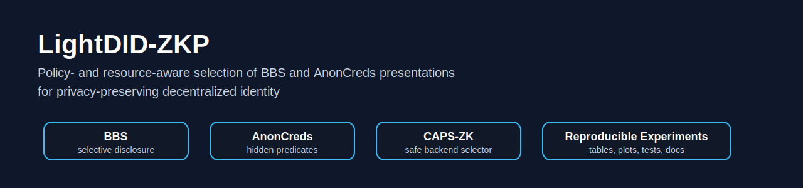
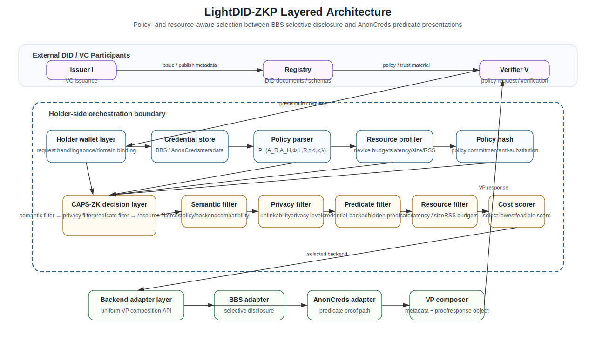
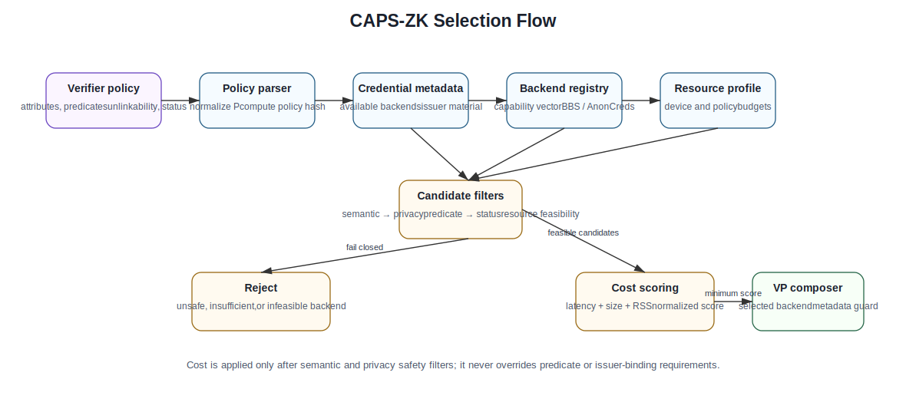
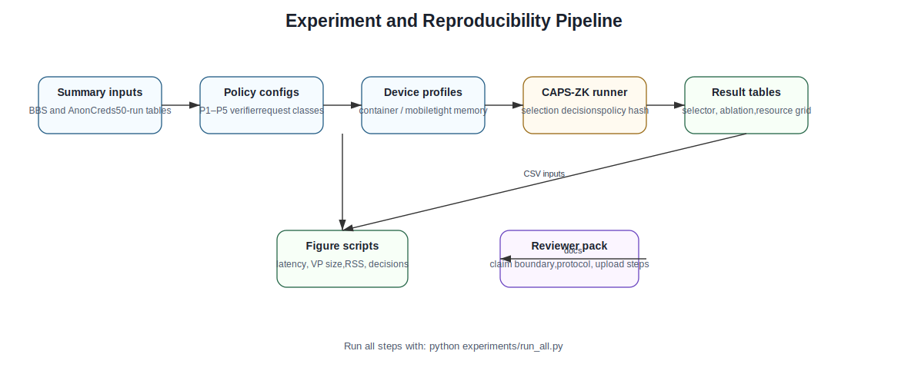
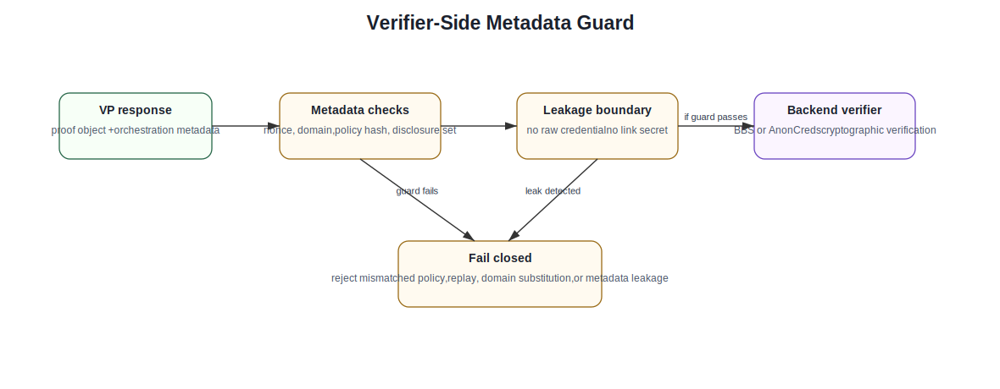

# LightDID-ZKP

<p align="center">
  
</p>

<p align="center">
  <b>Policy- and Resource-Aware Selection of BBS and AnonCreds Presentations for Privacy-Preserving Decentralized Identity</b>
</p>

<p align="center">
  
  
  
  
</p>

---

## Overview

**LightDID-ZKP** is a reproducible research prototype for selecting between **BBS selective-disclosure presentations** and **AnonCreds credential-backed predicate presentations** in privacy-preserving decentralized identity systems.

The project focuses on a practical question:

> When a holder has multiple privacy-preserving presentation mechanisms available, how should the wallet select the most suitable one under verifier policy, disclosure requirements, predicate needs, and resource constraints?

LightDID-ZKP introduces a policy-aware selector called **CAPS-ZK** that chooses a presentation strategy based on:

* required verifier policy,
* attribute disclosure constraints,
* predicate proof requirements,
* estimated proof size,
* estimated proving and verification latency,
* holder-side resource profile,
* fallback safety rules.

The repository contains source code, experiment scripts, benchmark summaries, plots, configuration files, and documentation for reproducing the tables and figures used in the LightDID-ZKP manuscript.

---

## Key Features

* **Policy-aware presentation selection**

  * Selects between BBS and AnonCreds based on policy and proof requirements.

* **Resource-aware decision logic**

  * Uses latency, verification time, VP size, and memory constraints during selection.

* **CAPS-ZK selector**

  * A lightweight orchestration layer for choosing a suitable presentation mechanism without modifying the underlying credential cryptography.

* **BBS selective-disclosure profile**

  * Models BBS-style presentations for cases where selected attributes need to be revealed.

* **AnonCreds predicate profile**

  * Models AnonCreds-style presentations for credential-backed predicate proofs.

* **Experiment reproduction**

  * Includes scripts to regenerate result tables, selector outputs, ablation summaries, and figures.

* **Reviewer-safe research scope**

  * This repository is a research prototype and experiment package. It does not claim to introduce a new cryptographic primitive.

---

## Repository Structure

```text
LightDID-ZKP/
│
├── assets/
│   └── diagrams/
│       ├── lightdid_banner.svg
│       ├── lightdid_layered_architecture.svg
│       ├── caps_zk_selection_flow.svg
│       ├── experiment_pipeline.svg
│       └── verifier_metadata_guard.svg
│
├── benchmarks/
│   ├── lightdid_benchmark_summary.csv
│   ├── selector_decisions.csv
│   ├── resource_sensitivity.csv
│   └── ablation_cost_first_fallback.csv
│
├── configs/
│   ├── policies.yaml
│   ├── device_profiles.yaml
│   └── experiment_config.yaml
│
├── docs/
│   ├── ARCHITECTURE.md
│   ├── DEVELOPER_GUIDE.md
│   ├── REVIEWER_NOTES.md
│   └── GITHUB_ABOUT.md
│
├── experiments/
│   ├── run_all.py
│   ├── generate_tables.py
│   ├── plot_results.py
│   └── optional_real_backend_templates/
│
├── results/
│   ├── figures/
│   └── tables/
│
├── src/
│   └── lightdid_zkp/
│       ├── selector.py
│       ├── policy.py
│       ├── profiles.py
│       ├── metrics.py
│       └── utils.py
│
├── tests/
│   └── test_selector.py
│
├── README.md
├── requirements.txt
├── pyproject.toml
├── CITATION.cff
└── LICENSE
```

---

## System Architecture

<p align="center">
  
</p>

LightDID-ZKP separates the decentralized identity workflow into four layers:

1. **Issuer and credential layer**

   * Issues verifiable credentials using supported credential formats.

2. **Holder wallet layer**

   * Stores credentials and invokes the CAPS-ZK selector.

3. **Presentation selection layer**

   * Selects between BBS and AnonCreds based on policy and resource constraints.

4. **Verifier policy layer**

   * Defines required attributes, predicate conditions, and metadata restrictions.

---

## CAPS-ZK Selection Flow

<p align="center">
  
</p>

The selector evaluates each request using the following logic:

```text
Input:
  - verifier policy
  - required attributes
  - predicate requirements
  - holder device profile
  - candidate presentation mechanisms

Output:
  - selected mechanism: BBS or AnonCreds
  - reason for selection
  - estimated cost profile
  - safety/fallback decision
```

The selector avoids unsafe cost-only choices. For example, if a verifier policy requires a credential-backed predicate, a cheaper selective-disclosure proof is not selected unless it satisfies the policy semantics.

---

## Supported Presentation Profiles

| Profile                              | Main Use Case                                       | Strength                                             |
| ------------------------------------ | --------------------------------------------------- | ---------------------------------------------------- |
| **BBS selective disclosure**         | Reveal selected attributes from a signed credential | Compact disclosure for attribute-based presentations |
| **AnonCreds predicate presentation** | Prove predicates over credential attributes         | Strong fit for credential-backed predicate proofs    |
| **CAPS-ZK selector**                 | Choose between available mechanisms                 | Policy-aware and resource-aware orchestration        |

---

## Experiment Pipeline

<p align="center">
  
</p>

The experiment package includes:

* benchmark summary tables,
* selector decision outputs,
* ablation study outputs,
* resource-sensitivity outputs,
* generated figures,
* optional real-backend benchmark templates.

The measured experiment configuration follows:

```text
Warmup runs:      5
Measured runs:    50
Attribute counts: 4, 8, 16, 32, 64
Mechanisms:       BBS, AnonCreds
Metrics:          proving latency, verification latency, VP size, RSS memory, CV
```

---

## Quick Start

### 1. Clone the repository

```bash
git clone https://github.com/dranubhaparashar/LightDID-ZKP.git
cd LightDID-ZKP
```

### 2. Create a virtual environment

```bash
python -m venv .venv
```

Activate it:

```bash
# Windows
.venv\Scripts\activate

# macOS/Linux
source .venv/bin/activate
```

### 3. Install dependencies

```bash
pip install -r requirements.txt
```

### 4. Run all experiments

```bash
python experiments/run_all.py
```

### 5. Run tests

```bash
pytest -q
```

---

## Reproducing Tables and Figures

To regenerate tables:

```bash
python experiments/generate_tables.py
```

To regenerate figures:

```bash
python experiments/plot_results.py
```

Generated outputs are written to:

```text
results/tables/
results/figures/
```

---

## Example Selector Usage

```python
from lightdid_zkp.selector import select_presentation
from lightdid_zkp.policy import VerifierPolicy
from lightdid_zkp.profiles import DeviceProfile

policy = VerifierPolicy(
    required_attributes=["name", "degree", "institution"],
    predicate_requirements=[],
    max_vp_size_kb=32,
    require_credential_backed_predicate=False
)

device = DeviceProfile(
    name="mobile_like",
    max_latency_ms=500,
    max_memory_mb=512
)

decision = select_presentation(policy=policy, device=device)

print(decision.mechanism)
print(decision.reason)
```

---

## Example Output

```text
Selected mechanism: BBS
Reason: Policy requires selective disclosure only; BBS satisfies disclosure constraints with lower estimated presentation size.
```

For predicate-heavy policies, the selector can choose AnonCreds:

```text
Selected mechanism: AnonCreds
Reason: Verifier policy requires credential-backed predicate proof; AnonCreds satisfies predicate semantics.
```

---

## Verifier Metadata Guard

<p align="center">
  
</p>

LightDID-ZKP also models verifier-side metadata restrictions so that a low-cost proof is not selected when it violates the verifier’s required proof semantics.

This is important because a wallet selector must not optimize only for speed or size. It must first satisfy the verifier policy.

---

## Results Included

The repository includes result files for:

* BBS presentation latency,
* AnonCreds presentation latency,
* verification time,
* VP size,
* RSS memory usage,
* coefficient of variation,
* selector decisions across policy types,
* ablation comparison against unsafe cost-first fallback,
* resource-sensitivity analysis.

Result files are available in:

```text
benchmarks/
results/tables/
results/figures/
```

---

## Research Scope and Claim Boundary

This project is intentionally scoped as a **policy-aware and resource-aware selection framework**.

It does **not** claim:

* to introduce a new zero-knowledge proof primitive,
* to replace BBS or AnonCreds,
* to provide production wallet security certification,
* to validate constrained-device deployment unless real device measurements are added,
* to provide a full DID wallet implementation.

It does claim:

* to provide a reproducible selection framework,
* to compare presentation-level trade-offs,
* to model policy/resource constraints,
* to provide a clean prototype for future wallet-side integration.

---

## Optional Real-Backend Benchmarks

The repository includes optional templates for integrating real cryptographic backends.

These templates are placed under:

```text
experiments/optional_real_backend_templates/
```

They are intentionally separated from the main reproducibility path because library versions, cryptographic bindings, and runtime support may differ across systems.

---

## Suggested GitHub Topics

```text
decentralized-identity
verifiable-credentials
zero-knowledge-proofs
bbs-signatures
anoncreds
privacy-preserving
digital-identity
selective-disclosure
zkp
did
```

---

## Citation

If you use this repository, please cite the associated LightDID-ZKP manuscript:

```bibtex
@article{lightdidzkp2026,
  title   = {LightDID-ZKP: Policy- and Resource-Aware Selection of BBS and AnonCreds Presentations for Privacy-Preserving Decentralized Identity},
  author  = {Parashar, Anubha and collaborators},
  journal = {Manuscript under preparation},
  year    = {2026}
}
```

---

## Maintainer

**Dr. Anubha Parashar**
GitHub: [@dranubhaparashar](https://github.com/dranubhaparashar)

---

## License

This repository is released for academic and research use. See the `LICENSE` file for details.

---

## Acknowledgement

LightDID-ZKP builds on the broader decentralized identity ecosystem, including verifiable credentials, selective disclosure, BBS signatures, and AnonCreds-style predicate presentations. The repository is intended to support reproducibility, experimentation, and future research on privacy-preserving wallet-side presentation selection.
